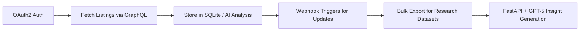

# 🧩 Whatnot API Integration Specification
### For Vintage Jeans Research Framework (FastAPI + GPT-5 + SQLite)

---

## 🎯 Purpose

Integrate the **Whatnot Seller API** to allow:
- **Market Research** (read-only): Analyze listings, pricing, and vintage trends.
- **Seller Sync** (write access): Enable connected sellers to import, create, and update listings.

---

## 🧠 Overview

The Whatnot Seller API (GraphQL) is currently in Developer Preview. Access may require approval.

**Docs:** [https://developers.whatnot.com](https://developers.whatnot.com)

---

## 🔐 Authentication – OAuth2 Flow

### Step 1. Register Your App (Once access opens)
Prepare these fields for submission:
- App Name: `Vintage Jeans Research`
- Redirect URI: `https://yourdomain.com/oauth/callback`
- Scopes:
  - `read:inventory`
  - `write:inventory`
  - `read:orders`
  - `read:users`

### Step 2. FastAPI OAuth2 Routes

```python
from fastapi import APIRouter, Request
import requests, os

router = APIRouter()

CLIENT_ID = os.getenv("WHATNOT_CLIENT_ID")
CLIENT_SECRET = os.getenv("WHATNOT_CLIENT_SECRET")
REDIRECT_URI = os.getenv("WHATNOT_REDIRECT_URI")
TOKEN_URL = "https://api.whatnot.com/oauth/token"

@router.get("/whatnot/connect")
def connect():
    url = f"https://whatnot.com/oauth/authorize?client_id={CLIENT_ID}&response_type=code&redirect_uri={REDIRECT_URI}&scope=read:inventory+write:inventory"
    return {"auth_url": url}

@router.get("/oauth/callback")
def callback(code: str):
    data = {
        "client_id": CLIENT_ID,
        "client_secret": CLIENT_SECRET,
        "grant_type": "authorization_code",
        "redirect_uri": REDIRECT_URI,
        "code": code,
    }
    token_resp = requests.post(TOKEN_URL, data=data).json()
    return token_resp
```

---

## 📦 GraphQL Endpoints

### Base Endpoint
```
https://api.whatnot.com/seller-api/graphql
```

### Authentication Header
```
Authorization: Bearer wn_access_tk_XXXXXX
```

---

## 🧾 Example Queries

### Read Listings (for Market Research)
```graphql
query {
  listings(first: 10) {
    edges {
      node {
        id
        title
        price
        brand
        category
        createdAt
      }
    }
  }
}
```

### Create Listing (for Seller Sync)
```graphql
mutation {
  createListing(input: {
    title: "Levi’s 501 Vintage Jeans",
    description: "1980s USA-made Levi’s 501, worn-in condition.",
    price: 120.00,
    category: "Vintage Jeans"
  }) {
    listing {
      id
      title
      price
      status
    }
  }
}
```

### Update Listing
```graphql
mutation {
  updateListing(input: {
    id: "LISTING_ID_HERE",
    price: 140.00
  }) {
    listing {
      id
      title
      price
    }
  }
}
```

---

## 🚀 Bulk Data Export (for Historical Research)

Use GraphQL mutation:
```graphql
mutation {
  createBulkExport(input: {
    query: "query { listings { edges { node { id title price brand createdAt } } } }"
  }) {
    export {
      id
      status
      downloadUrl
    }
  }
}
```

You can poll the export job until status = `COMPLETED`, then download JSONL file for ingestion.

---

## 📬 Webhooks (for Real-time Updates)

**Supported Topics:**
- `listing/created`
- `listing/updated`
- `product/sold`

### FastAPI Example Handler

```python
from fastapi import APIRouter, Request, Header
import hmac, hashlib, os, json

router = APIRouter()

WEBHOOK_SECRET = os.getenv("WHATNOT_WEBHOOK_SECRET")

@router.post("/webhook/whatnot")
async def handle_webhook(request: Request, x_whatnot_webhook_signature: str = Header(None)):
    body = await request.body()
    expected_sig = hmac.new(WEBHOOK_SECRET.encode(), body, hashlib.sha256).hexdigest()

    if not hmac.compare_digest(expected_sig, x_whatnot_webhook_signature):
        return {"status": "unauthorized"}

    event = json.loads(body)
    print(f"Received Whatnot event: {event}")
    # Store in DB or trigger AI summary workflow
    return {"status": "ok"}
```

---

## 🗃️ SQLite Schema Mapping

Map Whatnot listing data to local research DB.

```sql
CREATE TABLE IF NOT EXISTS whatnot_listings (
    id TEXT PRIMARY KEY,
    title TEXT,
    description TEXT,
    brand TEXT,
    price REAL,
    category TEXT,
    created_at TEXT,
    updated_at TEXT,
    platform TEXT DEFAULT 'Whatnot'
);
```

---

## 🧩 Integration Flow Summary



---

## 🔄 Implementation Steps

1. Register app on Whatnot Developer Portal (when available).
2. Implement OAuth flow in FastAPI.
3. Create GraphQL client (use `requests` or `gql`).
4. Map listing + sales data into SQLite.
5. Add webhook route to receive live updates.
6. Use GPT-5 summarization to generate market insights.
7. Build optional frontend dashboard to display real-time sales analytics.

---

## 🧱 Recommended Packages

```
pip install requests gql python-dotenv fastapi uvicorn
```

---

## ✅ Outcome

Once connected, your platform can:
- Pull live Whatnot listings to analyze vintage jeans market trends.
- Automatically sync seller inventory with your own marketplace.
- Record sales and pricing data for AI-driven insight generation.
- Maintain compliance through OAuth-secured API integration.

---
